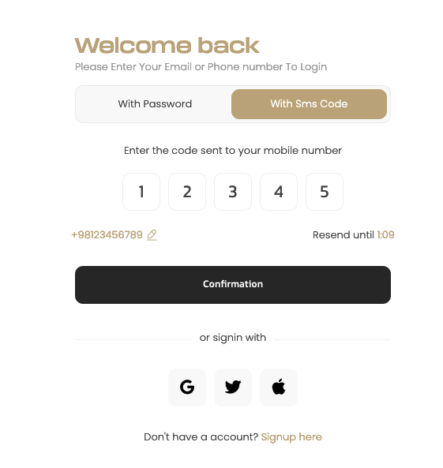

# pinCode Class

A JavaScript class for creating and managing PIN code inputs.

* **Version:** 1.0.1
* **Author:** Fariborz Jafarzadeh
* **License:** MIT
* **Contact:** fariborzj2@gmail.com

## Demo
A screenshot of the plugins pincode input fields with single instance to illustrate a login procedure and two instances for registration purposes:   
* **Demo Url:** https://fariborzj2.github.io/pincode


## Introduction

The PinCode class provides a simple and customizable way to create and manage PIN code inputs in JavaScript-based applications. It offers various features such as customizable input fields, placeholder characters, event handling, validation, and more.

## Installation

You can install the PinCode class via npm:

```bash
npm install pin-code
```

## Basic Usage

1. Include the pincode JavaScript file in your HTML:

```html
<script src="pincode.min.js"></script>
```

2. Create an HTML container element where you want the PIN code inputs to appear

```html
<div id="pin-box"></div>
```

3. Initialize the pincode library with the container element selector and any options you want to customize:
```javascript
const pinCode = new pinCode(document.getElementById('pin-box'), {
    fields: 5,
    placeholder: "•",
    autofocus: true,
    hideinput: true,
    // reset: true,
    pattern: "^[0-9]*$",
    copypaste: true,
    complete: function(pincode) {
        console.log("PIN code entered:", pincode);
    },
    invalid: function(input, index) {
        console.log("Invalid input detected at index", index);
    },
    keydown: function(event, input, index) {
        console.log("Keydown event:", event.key, "Input index:", index);
    },
    input: function(event, input, index) {
        console.log("Input event:", event.target.value, "Input index:", index);
    }
});
```

## Configuration Options
Customize the pincode library behavior with the following options:

* **fields (number):** Number of input fields for the PIN code. Default: 5.
* **placeholder (string):** Placeholder character for empty fields. Default: '•'.
* **autofocus (boolean):** Whether to focus on the first input field automatically. Default: true.
* **hideinput (boolean):** Whether to hide the input characters. Default: true.
* **reset (boolean):** Whether to reset the PIN code after completion. Default: false.
* **pattern (string):** Regular expression pattern for input validation. Default: "^[0-9]*$".
* **copypaste (boolean):** Whether to allow copying and pasting the PIN code. Default: true.
* **complete (function):** Callback function called when the PIN code is completed.
* **invalid (function):** Callback function called when an invalid input is detected.
* **keydown (function):** Callback function called on keydown event for custom handling.
* **input (function):** Callback function called on input event for custom handling.

## Methods

* **reset():** Resets the PIN code inputs.
* **disable():** Disables all input fields.
* **enable():** Enables all input fields.


## Methods

* **complete(pincode):** Triggered when the PIN code is completed.
* **invalid(input, index):** Triggered when an invalid input is detected.
* **keydown(event, input, index):** Triggered on keydown event for custom handling.
* **input(event, input, index):** Triggered on input event for custom handling.

## License

[MIT License](https://opensource.org/licenses/mit-license) © Fariborz Jafarzadeh

## Contribution
Contributions are welcome! Fork the repository, make your changes, and submit a pull request.

## Support
For any inquiries or issues, feel free to contact the author at fariborzj2@gmail.com.
